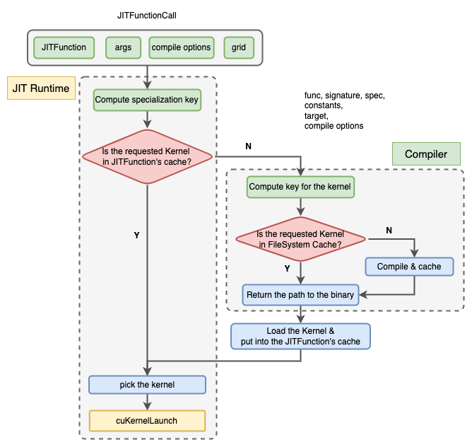

# Triton JIT C++ runtime

## Introduction

The project `libtriton_jit` is an implementation of Triton runtime in C++. It offers shims to make it easier to use Triton Lang inside a C++-based project. The user experience is similar to Triton's native Python runtime. You can define Jit functions in Python scripts and run them in c++ code.

It aims to reduce the inevitable Python overhead when using Triton in Python code. For many kernels, the execution time of the kernel is much shorter than the CPU overhead. Assume that we define a function(the wrapper) to compute torch tensors, which invokes some triton jit functions. The CPU overhead comes mainly from three parts:

- wrapper overhead(mainly tensor metadata computation and argument preprocessing);
- jit overhead(extracting information from arguments to get the kernel, including type and specialization of arguments and value of constexpr arguments);
- kernel launch overhead(in cuda, cuLaunchKernel introduces about 6us per kernel launch);

Also, since the wrapper is registered to the torch dispatcher for PyTorch-2-compliance. Torch dispatcher adds extra overhead to the wrapper. Our experiments show that the extra overhead for C++ wrappers is much lighter than for Python wrappers. Since `libtriton_jit` makes it possible to provide C++ wrapper with triton jit functions, we can reduce this extra overhead, too.

## Overview of Triton JIT C++ Runtime

The most user-facing part of this project is a C++ class `TritonJitFunction`, which stands for a triton jit function defined in some python script. It jit-compiles the jit function to multiple kernels and caches them in a per `TritonJitFunction` fashion(a in-memeory cache for the runtime). The compilation is delegated to  `triton.compile`. The cache of compiled kernels for all triton jit functions are managed by triton's `CacheManager`(a persistent cahce for the compiler).



The JIT compilation system consists of two components, namely, the JIT runtime and the Compiler.  The JIT runtime which specializes a jit function, invokes the compilation and run the compiled kernel; and the Compiler that compiles the specified kernel and return the compiled kernel to the runtime. We reimplement the JIT runtime in C++ while reusing the existing triton compiler.

### Specify the JIT Function

In Triton's original JIT runtime in Python, the `__call__` method of JITFunction inspects each argument passed to the JITFunction and extracts information from it. It includes 3 cases:

- For parameters not annotated with `tl.constexpr` type hint,  it extracts its type, or data type if it has a `data_ptr` method(intended for torch Tensors).

- For parameters not annotated with `tl.constexpr`, if it is not marked as `do_not_specialize`, it extracts features of some arguments. The features include boolean flags indicating whether an integer or a data pointer equals 1 or is divisible by 16. The features to extract can also be customized by backends.

- For parameters annotated with `tl.constexpr`, the actual value is extracted. Those parameters are for the compiled rather than the compiled kernel.

While it is easy to inspect the type of arguments in Python, it is not that straightforward in C++, since type and object(instance) are different things in C++, while in Python, a type is also an object. As a result, manipulation of types in C++ is at compile time, which mainly involves templates or template meta programming.

Before we start explaining the details, we coin the concept **StaticSignature** for a JITFunction. It is the part of logic about how to process its arguments that is only related to the function itself, without knowing the actual arguments passed in. Represented as `tl.constexpr` type annotation and `do_not_specialize` argument to the `triton.jit` decorator, it describes how to route the parameters, to pass to the compiler, or the compiled kernel, and whether to specialize the argument or not. Note that whether an argument is passed to the kernel depends not only on the static signature, but also on the actual values of the arguments if they need specialization.

The C++ class`TritonJitFunction` has a variadic function template `operator()` to specify a jit function at callsites. Since it is a variadic template, it captures the type of all the templated arguments' type at the callsite. The types of arguments, along with the static signature provided by the JitFunction, make up the logic to handle arguments. It then builds a full signature that specifies a kernel, and picks all the arguments for the kernel launch. The logic of inspecting the arguments mentioned above is implemented in C++, which is the core of the Triton JIT C++ runtime.

In the current implementation, the full signature is represented as a concatenated string with semicolons as separators. Each part corresponds to a parameter of the jit function.

- For constexpr, the format is `{value}`, the value is formatted as-is, and the type is omitted. Note that boolean values are formatted as  "0" or "1", and None is formatted as "nullopt" since the corresponding C++ object of Python value `None` is `std::nullopt`.

- For other parameters, the format is `{type}{spec}`.

  - type: for a C++ type, there is a mapping from it to a string, for example, int64_t is mapped to "i64". For a torch Tensor, there is also a mapping from its data type to a string with the same rule. The string is prefixed with a `*`, which means it is a pointer to that type;

  - Spec: specialization is only for data pointers or integers. It has 3 values, ":16" means divisible by 16, ":1" means equals 1, and "" means neither.

### Invokes the Compilation

Once the full signature is acquired, a standalone Python script (`standalone_compile.py`) is executed to compile a kernel and return the path of the compiled kernel (see class `TritonKernel` for more details), which is then loaded into a per `TritonJitFunction` cache.

Note that the script trys to import the Python file in which the triton jit function is defined. So the Python file should be able to be imported directly. It must not use relative imports.

### Run the Compiled Kernel

Along with the process of composing the full signature, arguments for the kernel launch are also gathered while arguments for the compiler are filtered out. Then the arguments for the compiled kernel are used via a low-level driver API. Now it supports cuda driver API. The CUDA driver API `cuLaunchKernel` erases the type of all arguments by taking addresses of them via a pointer to void(`void*`). Backends with similar APIs can adapt the code to launch kernels. But other backends are also considered. For backends without such an indirect call API via type erasure, the captured type information from the callsite can be used to redirect the call to the kernel. Hopefully, we may see them soon.

This is the main facilities for calling jit functions from C++, which can be used to write operators.

## Usage

The basic usage of this library is via `TritonJITFunction`. First, get a `TritonJITFunction` via `TritonJITFunction::get_instance(source_path, function_name)`. Then call it.

The `operator()` of `TritonJITFunction` is a variadic template. The arguments consist of 2 parts.

- The fixed part is launch config and compile options for triton jit function.
- The variadic part is the arguments of the triton jit function.

A simple example to add two tensors.

```cpp
at::Tensor add_tensor(const at::Tensor &a_, const at::Tensor &b_) {
  auto res = torch::broadcast_tensors({a_, b_});
  res[0] = res[0].contiguous();
  res[1] = res[1].contiguous();
  const at::Tensor &a = res[0];
  const at::Tensor &b = res[1];

  at::ScalarType out_dtype = at::promote_types(a.scalar_type(), b.scalar_type());
  at::Tensor out = at::empty(a.sizes(), at::TensorOptions().dtype(out_dtype).device(a.device()));

  const triton_jit::TritonJITFunction &f =
      triton_jit::TritonJITFunction::get_instance("add.py", "binary_pointwise_kernel");

  // add utility to build this automatically
  int64_t tile_size = 1024;
  const int num_warps = 8;
  const int num_stages = 1;
  int64_t n = out.numel();
  const unsigned int num_blocks = (n + tile_size - 1) / tile_size;

  // getCurrentCUDAStream ensures that the stream is initialized, a default stream for each device
  c10::cuda::CUDAStream stream = c10::cuda::getCurrentCUDAStream();
  c10::DeviceGuard guard(out.device());
  CUstream raw_stream = static_cast<CUstream>(stream.stream());
  f(stream, num_blocks, 1, 1, num_warps, num_stages, a, b, out, n, tile_size);
  return out;
}
```

Since we are mainly focused on Torch now, operators mean some functions that

- handles torch tensors;
- dynamically dispatch to different backend-specific implementations based on the arguments.

They can use a lot of APIs provided by libtorch, including utility functions for metadata computation, and also all other ATen operators. But when the focus is on implementing operators with Triton Lang, we mainly use those utility functions for metadata computation and operators for output allocation and reviewing(viewing a tensor into another with different metadata and leaving the underlying storage untouched).

The operators can be registered in a Torch library via the `TORCH_LIBRARY` macro. Then the operators can be used from both C++ and Python. You don't even need to explicitly write Python bindings for them, since torch already provides a unified(boxed) way to call operators via the dispatcher.

We have examples of pointwise addition and summation.


## How to build

### Install dependencies

Though this project is a C++project, it embeds a Python interpreter to execute some Python code, so it has some Python dependencies. Also, those Python packages are not pure Python; this project also uses their CMake packages, headers, and libraries.

Also, CMake and Ninja can be installed from PyPI.

It is also recommended to install them in a Python virtual environment. Please note that using Anaconda or Miniconda is not recommended for this project. Their pre-packaged compilers and standard libraries can often lead to conflicts or errors during the project's build process.

```shell
# activate the Python virtualenv (optional)
pip install "torch>=2.5" "triton>=3.1.0,<3.4.0" "cmake" "ninja" "packaging" "pybind11" "numpy"
```

### Configure & Generate the Build System

Remember to specify which python root to use, since the python root is used to find libtorch and pybind11.

```shell
cmake -S . -B build/ -DPython_ROOT="$(which python)/../.."
```

You can also specify build type via `-DCMAKE_BUILD_TYPE` and install prefix by `-DCMAKE_INSTALL_PREFIX`.

### Build

To build the project, use the following command.

```shell
cmake --build build/ --parallel
```

### Install

Install the libraries, headers, scripts and cmake package configs to `CMAKE_INSTALL_PREFIX`.

```shell
cmake --install build/
```

If you are not intended to use it in other projects via `find_package`, this step can be omitted.

### How to use it in a c++ project

TritonJIT provides cmake packages, so it can be used with cmake. It can be used in 2 ways.

1. use the installed package, via `find_package`.
2. add the project as a sub-project, via `FetchContent`, `ExternProjectAdd` or `add_subdirectory`.

### Debug

We currently use torch's logging facilities, thus environment variable `TORCH_CPP_LOG_LEVEL=INFO` enables logging.


## RoadMap

- Support more backends
  - handle compile options for different backends
  - handle argument processing rules for different backends, if they have different rules to route the arguments;
  - support driver APIs for different backends(for TritonKernels's launch and lazy_init_handle method);
- Better argument processing
  - copy arguments to a buffer to ensure their lifetime;
  - add low level API for users to process arguments one by one manually;
- Expose Lower level APIs to be independent from libtorch
  - Use typed pointers as parameters instead of Tensors;
  - Considerations: delegate tensor allocation and metadata computation to other tensor libraries;
- support auto tunning:
  - Implement caching auto tuner
